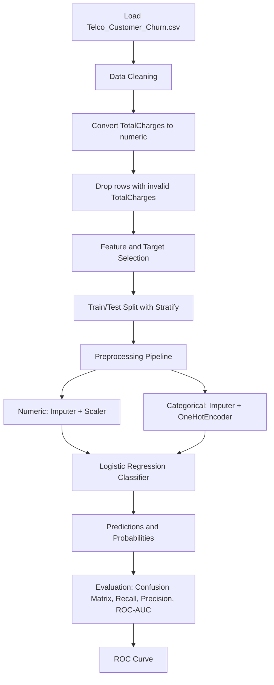
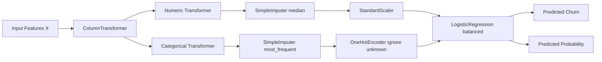

# Customer Churn Prediction (Telco)

Machine learning project for predicting customer churn using the Telco customer dataset.

## Team Members

- Priyanshu Anand (Roll No: UE238074)
- Vrinda Dubey (Roll No: UE238111)

## Project Links

- GitHub Repository: https://github.com/priyanshwho/chrun_predictor/
- Dataset Source (Kaggle): https://www.kaggle.com/datasets/blastchar/telco-customer-churn

## Dataset Used

- File: `Telco_Customer_Churn.csv`
- Task Type: Binary Classification (Churn prediction)

### Input Data (X)

The model uses the following features:

- Numeric features:
	- `tenure`
	- `MonthlyCharges`
	- `TotalCharges`
- Categorical features:
	- `gender`
	- `SeniorCitizen`
	- `Partner`
	- `Dependents`
	- `PhoneService`
	- `MultipleLines`
	- `InternetService`
	- `OnlineSecurity`
	- `OnlineBackup`
	- `DeviceProtection`
	- `TechSupport`
	- `StreamingTV`
	- `StreamingMovies`
	- `Contract`
	- `PaperlessBilling`
	- `PaymentMethod`

### Output / Target Data (y)

- Target column: `Churn`
- Encoded mapping:
	- `No` -> `0`
	- `Yes` -> `1`

## Model Information

- Model Name: Logistic Regression
- Implementation: `LogisticRegression` inside a Scikit-learn `Pipeline`
- Class imbalance handling: `class_weight='balanced'`
- Data split: Train/Test split with `test_size=0.3`, `random_state=42`, `stratify=y`

## Working Process

1. Import libraries (`numpy`, `pandas`, `matplotlib`, `seaborn`, `scikit-learn`).
2. Load dataset from `Telco_Customer_Churn.csv`.
3. Clean `TotalCharges` by converting to numeric and dropping invalid rows.
4. Define input features (numeric + categorical) and target.
5. Explore dataset using visual EDA (class distribution, tenure distribution, charge analysis, contract churn rate, correlation heatmap).
6. Split data into train and test sets.
7. Encode target labels (`Yes/No` to `1/0`).
8. Build preprocessing + model pipeline:
	 - Numeric: median imputation + standard scaling
	 - Categorical: most frequent imputation + one-hot encoding
	 - Final model: Logistic Regression
9. Train model on training data.
10. Predict class labels and class probabilities on test data.
11. Evaluate with confusion matrix, recall, precision, and ROC-AUC.
12. Plot ROC curve.

## Workflow Diagram (Mermaid)



## Pipeline Architecture (Mermaid)



## Evaluation Snapshot

From the current executed notebook run:

- Rows after cleaning: `7032`
- Recall: `0.7950`
- Precision: `0.5040`
- ROC-AUC: `0.8378`

## Project Structure

```text
.
├── Customer_Churn_Prediction_Production_Code.ipynb
├── Telco_Customer_Churn.csv
├── Churn.pdf
├── pyproject.toml
├── uv.lock
└── README.md
```

## How to Run

### 1. Prerequisites

- Python `>= 3.11`
- `uv` installed

### 2. Install dependencies

```bash
uv sync
```

### 3. Open and run notebook

```bash
code .
```

Then open:

- `Customer_Churn_Prediction_Production_Code.ipynb`

Run cells from top to bottom.

### 4. If kernel issue appears

Register project kernel:

```bash
uv run python -m ipykernel install --user --name ml-uv --display-name "Python (ml-uv)"
```

In VS Code notebook kernel picker, select `Python (ml-uv)` and re-run cells.

## Report

- Report file included: `Churn.pdf`

## Notes

- This project is prepared for college assignment submission.
- Visual analysis and model pipeline are both included in the notebook.
